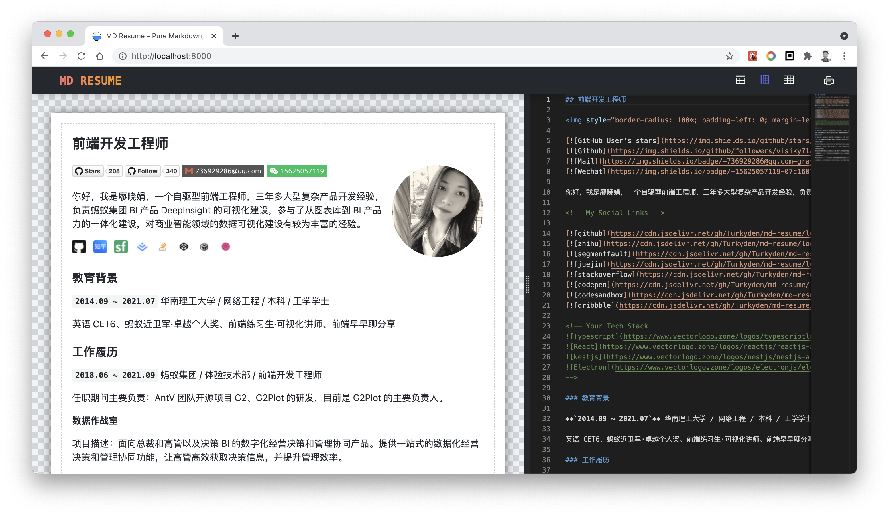

English | [简体中文](./README_cn-zh.md)

<h1 align="center">Markdown Resume</h1>

<p align="center">Pure Markdown, an online resume editor for developer.

</p>



<p align="center"><a href="https://md-resume.vercel.app" target="_blank">: : : Live Demo : : :</a></p>

> "Less is more", The simple things often bring people more enjoyment.
>
> 「大道至简」简单的东西往往带给人们的是更多的享受。
>
> \_\_\_ Baohaus

## ✨ Feather

- [x] Grid Layout System
- [x] PDF Print
- [x] Github Theme
- [x] Monaco Editor
- [ ] Avatar Filter
- [ ] Social Icon List
- [ ] Mult Template

## 🔨 Contribution

Install dependencies,

```bash
$ yarn
```

Start the dev server,

```bash
$ yarn start
```

## 🔖 Refference

- [TailwindCSS](http://watermark.dxcweb.com/)
- [Ant Design](https://github.com/bokuweb/react-rnd)
- [Umijs](http://watermark.dxcweb.com/)
- [Monaco Editor](https://github.com/pansyjs/react-components/tree/master/packages/watermark)
- [PatternCSS](https://bansal.io/pattern-css)

## ❤️ Contributors

Thanks goes to these people:


Please Feel free to enjoy and participate in open source!

## ⭐ Stargazers

Thanks for your star!

[](https://github.com/Turkyden/md-resume/stargazers)

## License

[MIT](./LICENSE)
